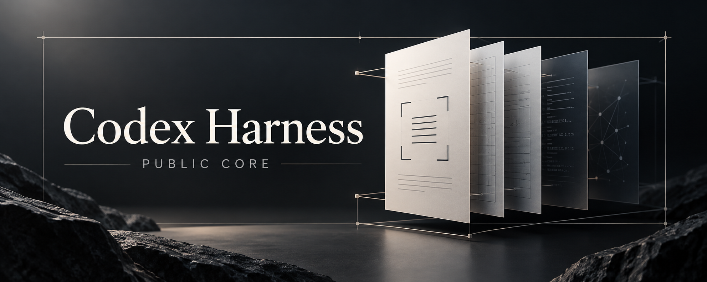

# Codex Harness — public core



**A test is not a pass just because a command exited successfully.**

A compact evidence-validation library and a risk-based engineering workflow for
Codex-assisted work. Reject missing cases, skipped acceptance, malformed receipts
and mismatched artifacts instead of presenting them as success.

## Run the checks

Python 3.11+; standard library only.

```sh
git clone https://github.com/sonson0910/codex-harness.git
cd codex-harness
python3 -m unittest -v test_evidence
python3 -O -m unittest -q test_evidence
```

Tests create temporary local fixtures; no model inference, browser server or
production database is needed. Inspect `test_evidence.py` for exact wire examples.

## Included

- `evidence.py`: closed-schema envelope/checker validation, declared-scope manifests,
  manifest digests and scoped reuse assessment.
- `test_evidence.py`: runnable success and rejection examples.
- [WORKFLOW.md](WORKFLOW.md): one writer per code/resource region, risk-based review,
  shared repair budgets and evidence-bound handoff.
- [MAC.md](MAC.md): use the public core on macOS without copying a personal setup.

The validator raises `EvidenceError` with a bounded code when a record is invalid.
Its schemas are intentionally strict: an extra field or incompatible version is
not silently accepted. A syntactically valid receipt is not proof its producer is
honest, a service worked, or a security review happened.

## Scope and limits

This is the portable public core, **not** the machine-bound four-job runner or a
drop-in copy of the maintainer's daily setup. No private plan pins, executable cache
identities, logs, screenshots, counters, credentials or full Mac export are shipped.
No live Chrome/Serena PASS from another machine is claimed for your environment.

The workflow is policy, not a sandbox or native enforcement layer. Artifact reuse
depends on a complete declared input/environment scope and a stable writer. It is
not global attestation or a defense against a hostile same-user process.

Companion: [GPT Kit](https://github.com/sonson0910/gpt-kit), task capsules and a
read-only usage collector. Independent project; not an official OpenAI product.

## Tiếng Việt

Bản public tập trung vào kiểm chứng evidence và quy trình Lean. Main xử lý task nhỏ;
review theo rủi ro, không mỗi file một đội. Không chứa cấu hình cá nhân hay runner
gắn với máy Linux của tác giả. macOS chưa được chạy kiểm chứng trực tiếp.

## Publication and reuse

See [NOTICE.md](NOTICE.md). No open-source license is granted by this initial
publication; contact the owner before redistribution or incorporation.
